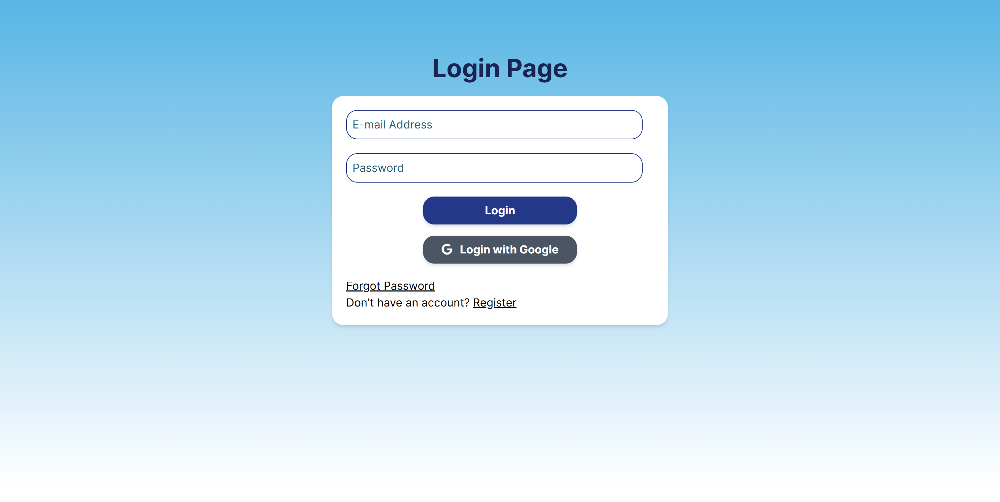
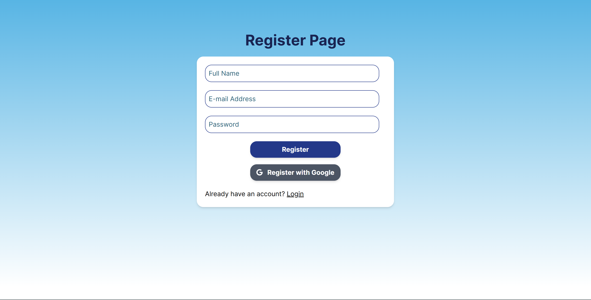
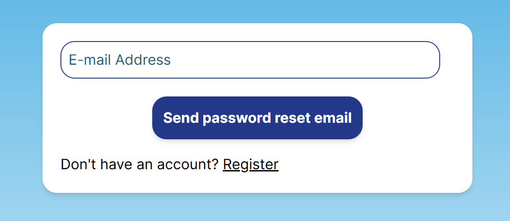
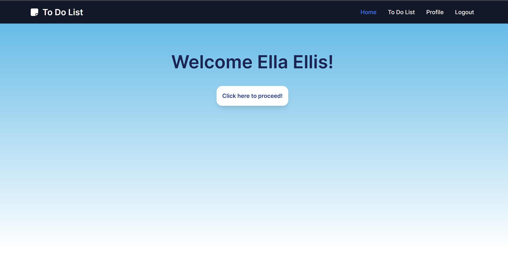
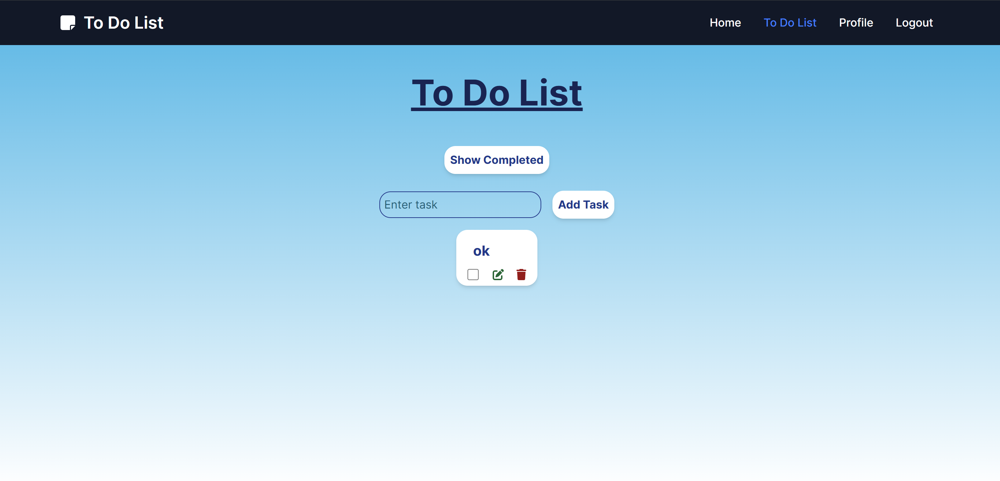
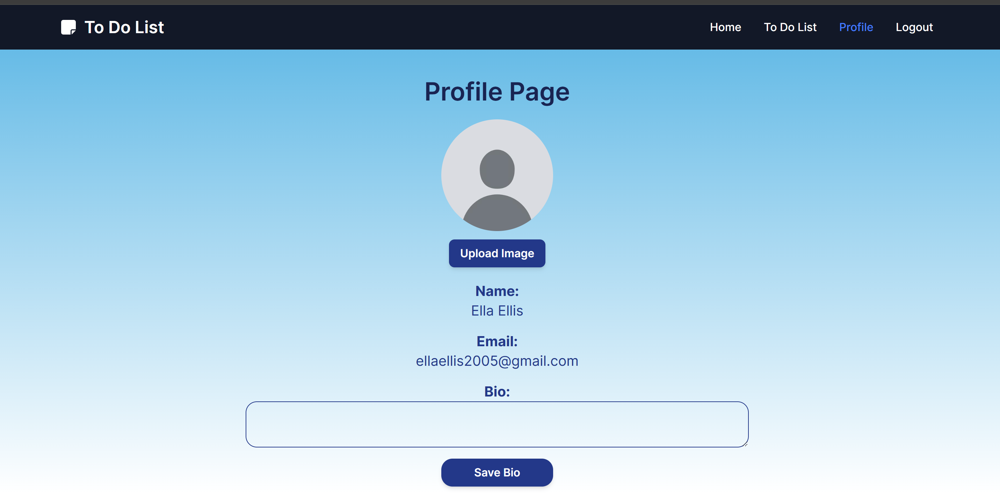

# WADS - To Do List

**Name:** Ellis Raputri

**Class:** L4AC

**Student ID:** 2702298116

<br>

## Project Description
This project is a simple To Do app containing a todo list that is connected to the firebase database. Each user can do login with their email or Google account to access the app. User can also customize their profile picture and bio in this app.

<br>

## Setup Process

### Cloning From GitHub
- Clone the repository and change directory to the respective repository
    ```text
    git clone https://github.com/ellisraputri/WADS-TA-ToDoList
    cd WADS-TA-ToDoList
    ```

- Installing all dependencies
    ```text
    npm install
    ```

- Run the application
    ```text
    npm run dev
    ```

<br>

### Pulling From Docker

- Pull the docker image from Docker Hub. You can see the public view of the docker repository [here](https://hub.docker.com/r/ellisraputri/todo-app).
    ```text
    docker pull ellisraputri/todo-app:latest
    ```

- Run the docker image.
    ```text
    docker run -p 5173:5173 ellisraputri/todo-app:latest
    ```

- You can now access the todo app in the link below.
    ```text
    http://localhost:5173/
    ```


<br>

## GUI Screenshots
<details>
<summary>&ensp;<b>Login and Register Page</b></summary>

- User can log in through the login page and register through the register page.

- If users forgot their password, they can also link to the forgot password page to resend an email to reconfigure their password.

    <br><br>

    <br><br>

    <br>

<br>
</details>

<details>
<summary>&ensp;<b>Home Page</b></summary>

- Landing page for the user to proceed to the To Do app.

  <br>

<br>
</details>

<details>
<summary>&ensp;<b>To Do Page</b></summary>

- Contains a simple to do app where users can add, update, or delete their tasks.

  <br>

<br>
</details>

<details>
<summary>&ensp;<b>Profile Page</b></summary>

- In this page, users can update their profile picture and bio.

  <br>

<br>
</details>


<br>

